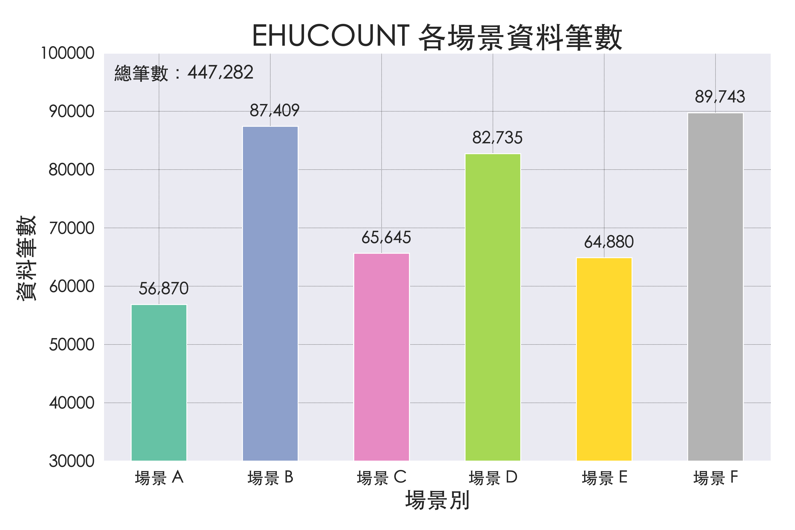
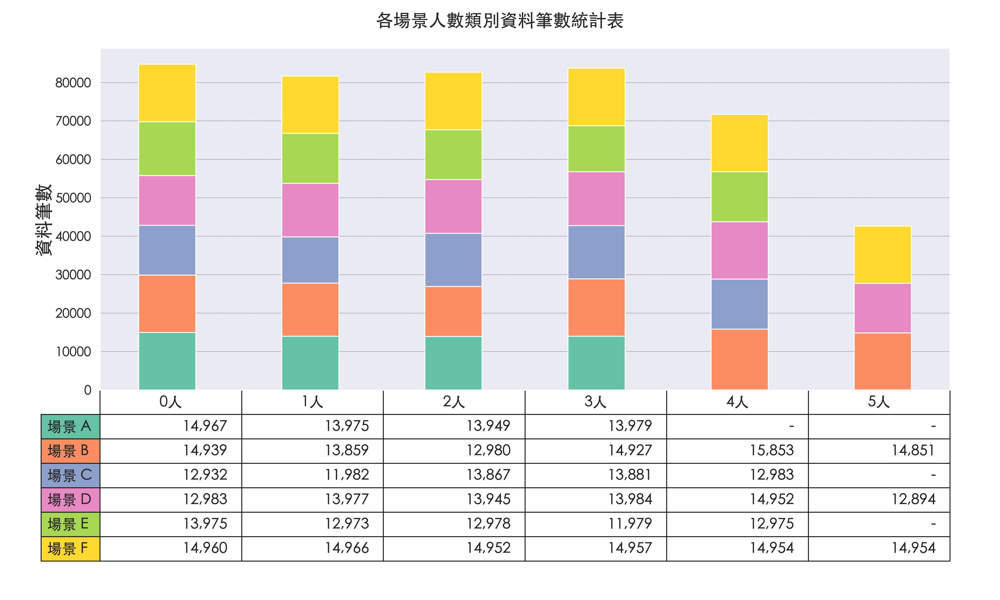
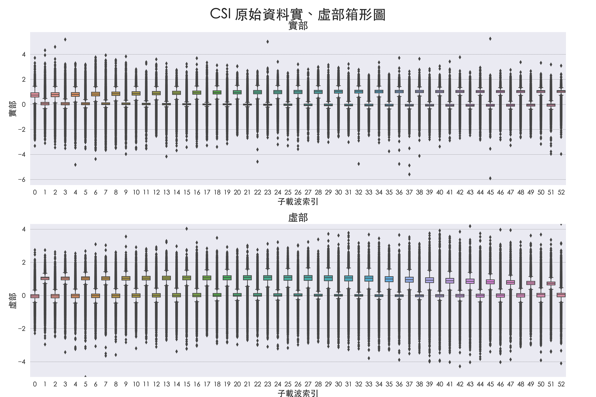
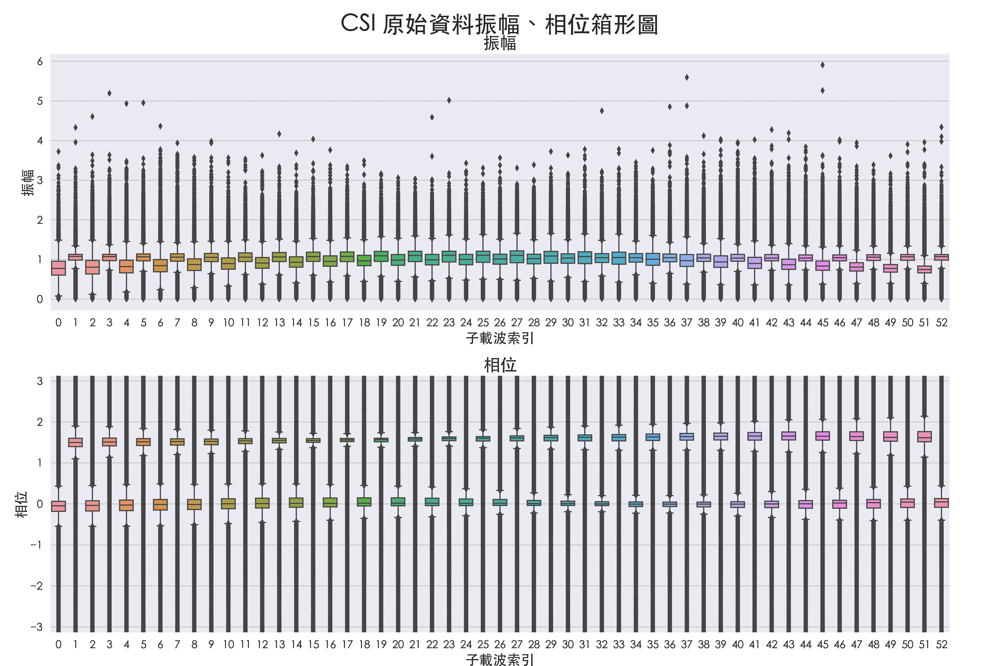
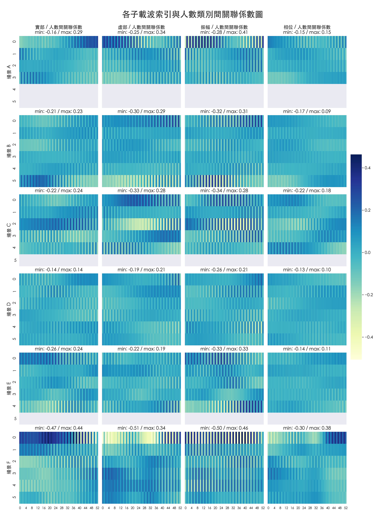

# 透過 WiFi CSI 進行人數預測

## EDA 資料探索統計圖表

### 資料筆數統計表

#### 一、EHUCOUNT 各場景資料筆數

#### 二、EHUCOUNT 各場景人數類別資料筆數

### 資料分佈箱形圖

#### 一、實、虛部各子載波索引資料箱形圖

#### 二、振幅、相位資料各子載波索引資料箱形圖

### CSI 各子載波索引散佈圖

#### 一、各場景子載波索引散佈圖

1. [場景 A 子載波人數散佈圖](Scenario_A.md)
2. [場景 B 子載波人數散佈圖](Scenario_B.md)
3. [場景 C 子載波人數散佈圖](Scenario_C.md)
4. [場景 D 子載波人數散佈圖](Scenario_D.md)
5. [場景 E 子載波人數散佈圖](Scenario_E.md)
6. [場景 F 子載波人數散佈圖](Scenario_F.md)

#### 二、各人數子載波索引散佈圖

1. [人數 0 各場景子載波佈圖](Crowd_0.md)
2. [人數 1 各場景子載波佈圖](Crowd_1.md)
3. [人數 2 各場景子載波佈圖](Crowd_2.md)
4. [人數 3 各場景子載波佈圖](Crowd_3.md)
5. [人數 4 各場景子載波佈圖](Crowd_4.md)
6. [人數 5 各場景子載波佈圖](Crowd_5.md)

### 關聯係數

#### 一、各資料種類子載波索引與人數類別間關聯係數熱力圖

#### 二、各資料種類與人數類別關聯係數

## 訓練成果圖表

### 從不同角度觀察模型學習成效

1. [多組抽樣種子在不同場景間的學習成效](RandomSeed.md)
2. [多種訓練資料比例在不同場景間的學習成效](TestSize.md)
3. [各模型在不同訓練資料比例下的學習成效](Model.md)
4. [不同模型對不同人數類別的學習成效](Crowd.md)

### 交叉驗證學習曲線 (K-Fold Cross Validation, k=5)

1. [訓練資料集學習曲線](TrainingSet.md)
2. [驗證資料集學習曲線](ValidationSet.md)

