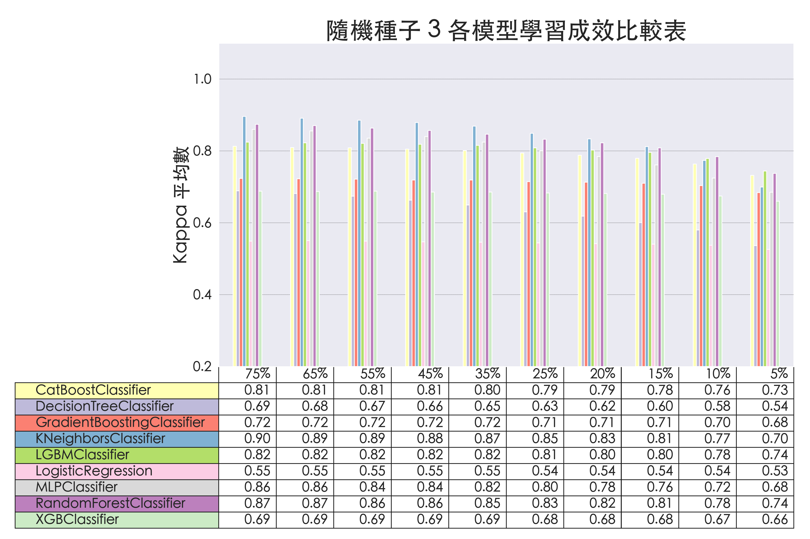
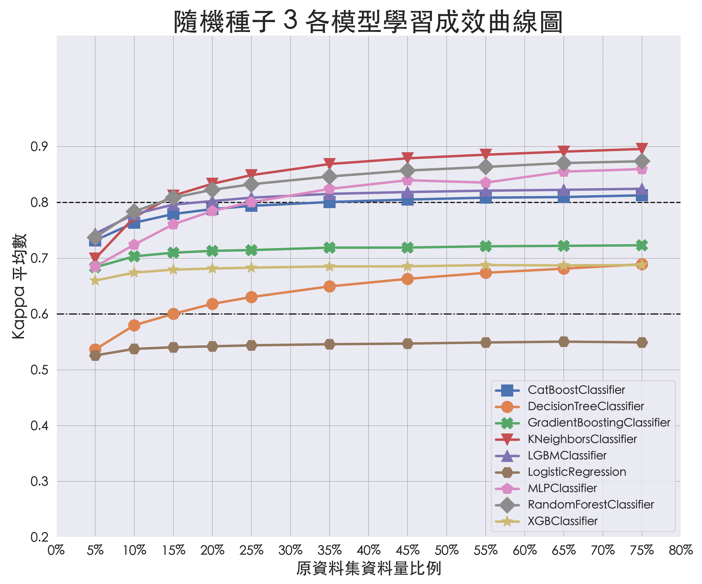
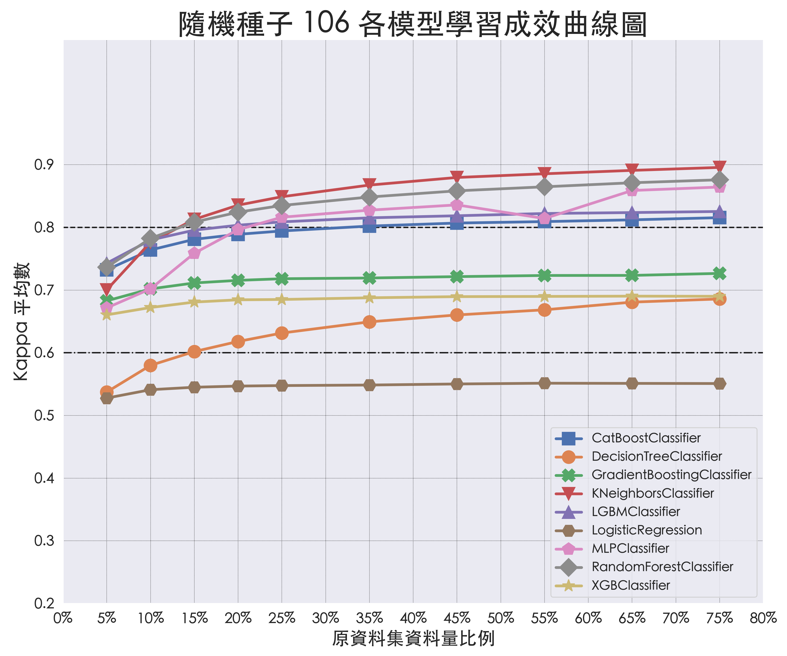
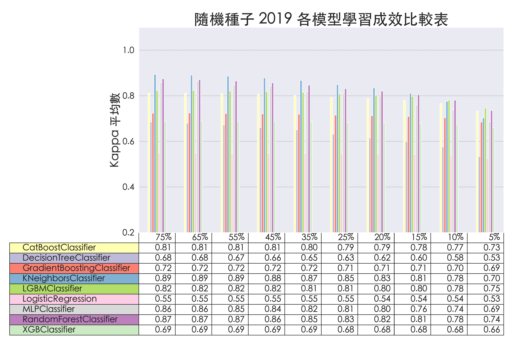
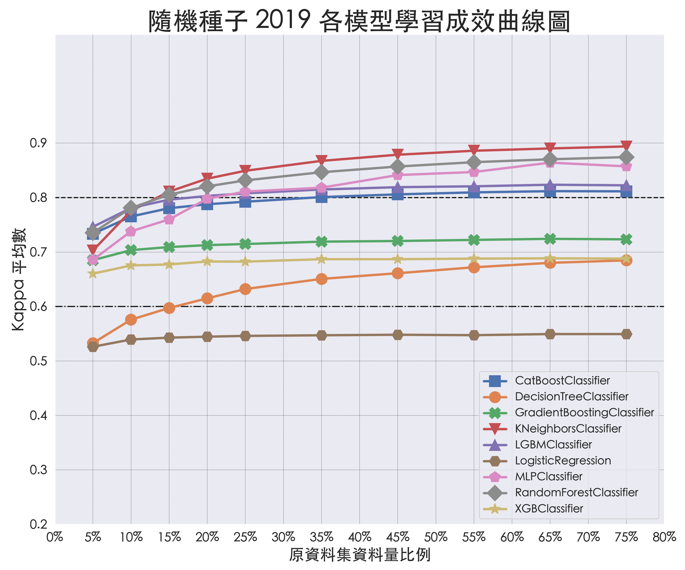

# 透過 WiFi CSI 進行人數預測

## EDA 資料探索統計圖表

### 資料筆數統計表

#### 一、EHUCOUNT 各場景資料筆數

#### 二、EHUCOUNT 各場景人數類別資料筆數

### 資料分佈箱形圖

#### 一、實、虛部各子載波索引資料箱形圖

#### 二、振幅、相位資料各子載波索引資料箱形圖

### CSI 各子載波索引散佈圖

#### 一、各場景子載波索引散佈圖

1. [場景 A 子載波人數散佈圖](eda/scenario/Scenario_A.md)
2. [場景 B 子載波人數散佈圖](eda/scenario/Scenario_B.md)
3. [場景 C 子載波人數散佈圖](eda/scenario/Scenario_C.md)
4. [場景 D 子載波人數散佈圖](eda/scenario/Scenario_D.md)
5. [場景 E 子載波人數散佈圖](eda/scenario/Scenario_E.md)
6. [場景 F 子載波人數散佈圖](eda/scenario/Scenario_F.md)

#### 二、各人數子載波索引散佈圖

1. [人數 0 各場景子載波佈圖](eda/crowd/Crowd_0.md)
2. [人數 1 各場景子載波佈圖](eda/crowd/Crowd_1.md)
3. [人數 2 各場景子載波佈圖](eda/crowd/Crowd_2.md)
4. [人數 3 各場景子載波佈圖](eda/crowd/Crowd_3.md)
5. [人數 4 各場景子載波佈圖](eda/crowd/Crowd_4.md)
6. [人數 5 各場景子載波佈圖](eda/crowd/Crowd_5.md)

### 關聯係數

#### 一、各資料種類子載波索引與人數類別間關聯係數熱力圖

#### 二、各資料種類與人數類別關聯係數

## 訓練成果圖表

### 從不同角度觀察模型學習成效

#### 一、多組抽樣種子在不同場景間的學習成效

1. [CatBoostClassifier](metrics/random_seed/RandomSeed_CatBoostClassifier.md)
2. [DecisionTreeClassifier](metrics/random_seed/RandomSeed_DecisionTreeClassifier.md)
3. [GradientBoostingClassifier](metrics/random_seed/RandomSeed_GradientBoostingClassifier.md)
4. [KNeighborsClassifier](metrics/random_seed/RandomSeed_KNeighborsClassifier.md)
5. [LGBMClassifier](metrics/random_seed/RandomSeed_LGBMClassifier.md)
6. [LogisticRegression](metrics/random_seed/RandomSeed_LogisticRegression.md)
7. [MLPClassifier](metrics/random_seed/RandomSeed_MLPClassifier.md)
8. [RandomForestClassifier](metrics/random_seed/RandomSeed_RandomForestClassifier.md)
9. [XGBClassifier](metrics/random_seed/RandomSeed_XGBClassifier.md)

#### 二、多種訓練資料比例在不同場景間的學習成效

1. [CatBoostClassifier](metrics/test_size/TestSize_CatBoostClassifier.md)
2. [DecisionTreeClassifier](metrics/test_size/TestSize_DecisionTreeClassifier.md)
3. [GradientBoostingClassifier](metrics/test_size/TestSize_GradientBoostingClassifier.md)
4. [KNeighborsClassifier](metrics/test_size/TestSize_KNeighborsClassifier.md)
5. [LGBMClassifier](metrics/test_size/TestSize_LGBMClassifier.md)
6. [LogisticRegression](metrics/test_size/TestSize_LogisticRegression.md)
7. [MLPClassifier](metrics/test_size/TestSize_MLPClassifier.md)
8. [RandomForestClassifier](metrics/test_size/TestSize_RandomForestClassifier.md)
9. [XGBClassifier](metrics/test_size/TestSize_XGBClassifier.md)

#### 三、各模型在不同訓練資料比例下的學習成效

##### （一）隨機種子 3 各模型學習成效

##### （二）隨機種子 106 各模型學習成效比較表

##### （三）隨機種子 2019 各模型學習成效比較表

##### （四）各隨機種子在不同訓練比例下的學習成效

1. [隨機種子 3 在不同模型下的學習成效](metrics/model/Model_RandomSeed_3.md)
2. [隨機種子 106 在不同模型下的學習成效](metrics/model/Model_RandomSeed_106.md)
3. [隨機種子 2019 在不同模型下的學習成效](metrics/model/Model_RandomSeed_2019.md)

#### 四、不同模型對不同人數類別的學習成效

##### （一）場景 A 中不同模型、不同人數的學習成效

1. [隨機種子 3 在不同模型、不同人數下的學習成效](metrics/crowd/A/Crowd_A_3.md)
2. [隨機種子 106 在不同模型、不同人數下的學習成效](metrics/crowd/A/Crowd_A_106.md)
3. [隨機種子 2019 在不同模型、不同人數下的學習成效](metrics/crowd/A/Crowd_A_2019.md)

##### （二）場景 B 中不同人數的學習成效

1. [隨機種子 3 在不同模型下的學習成效](metrics/crowd/B/Crowd_B_3.md)
2. [隨機種子 106 在不同模型下的學習成效](metrics/crowd/B/Crowd_B_106.md)
3. [隨機種子 2019 在不同模型下的學習成效](metrics/crowd/B/Crowd_B_2019.md)

##### （三）場景 C 中不同人數的學習成效

1. [隨機種子 3 在不同模型下的學習成效](metrics/crowd/C/Crowd_C_3.md)
2. [隨機種子 106 在不同模型下的學習成效](metrics/crowd/C/Crowd_C_106.md)
3. [隨機種子 2019 在不同模型下的學習成效](metrics/crowd/C/Crowd_C_2019.md)

##### （四）場景 D 中不同人數的學習成效

1. [隨機種子 3 在不同模型下的學習成效](metrics/crowd/D/Crowd_D_3.md)
2. [隨機種子 106 在不同模型下的學習成效](metrics/crowd/D/Crowd_D_106.md)
3. [隨機種子 2019 在不同模型下的學習成效](metrics/crowd/D/Crowd_D_2019.md)

##### （五）場景 E 中不同人數的學習成效

1. [隨機種子 3 在不同模型下的學習成效](metrics/crowd/E/Crowd_E_3.md)
2. [隨機種子 106 在不同模型下的學習成效](metrics/crowd/E/Crowd_E_106.md)
3. [隨機種子 2019 在不同模型下的學習成效](metrics/crowd/E/Crowd_E_2019.md)

##### （六）場景 F 中不同人數的學習成效

1. [隨機種子 3 在不同模型下的學習成效](metrics/crowd/F/Crowd_F_3.md)
2. [隨機種子 106 在不同模型下的學習成效](metrics/crowd/F/Crowd_F_106.md)
3. [隨機種子 2019 在不同模型下的學習成效](metrics/crowd/F/Crowd_F_2019.md)

### 交叉驗證學習曲線 (K-Fold Cross Validation, k=5)

1. [訓練資料集學習曲線](metrics/learning_curve/TrainingSet.md)
2. [驗證資料集學習曲線](metrics/learning_curve/ValidationSet.md)

