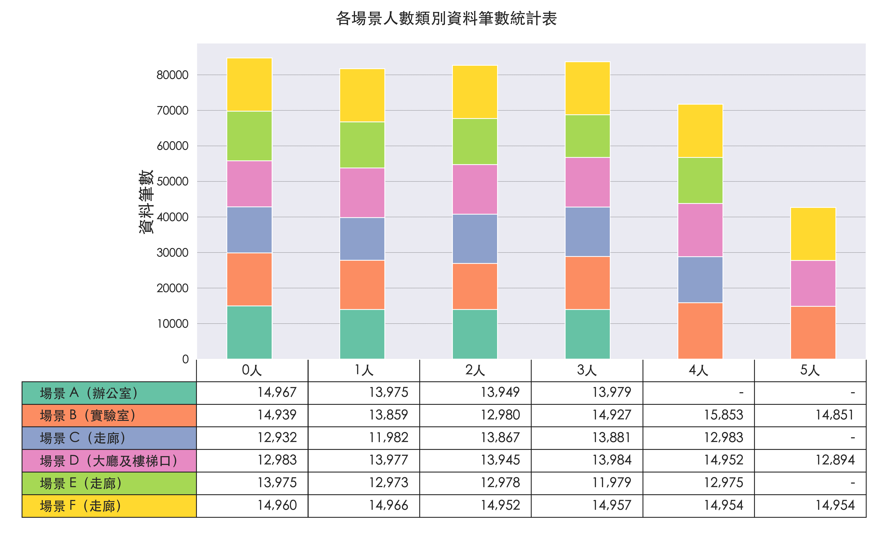
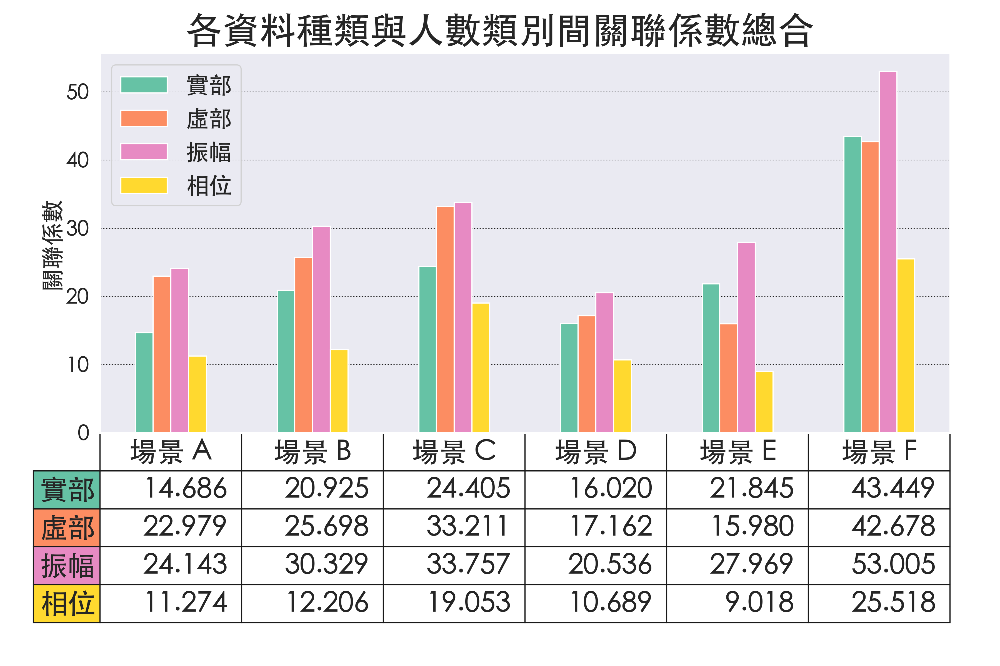
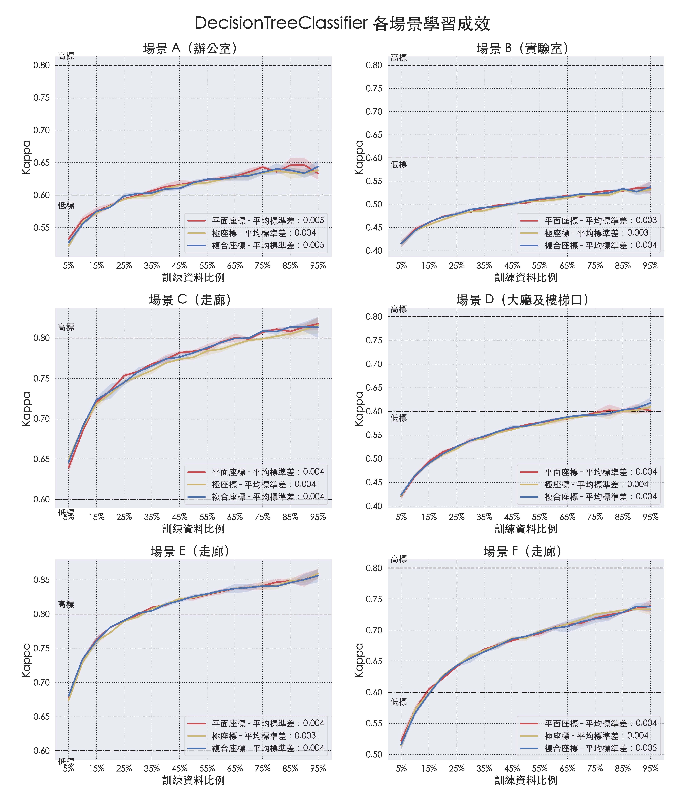

# 透過 WiFi CSI 進行人數預測

## EDA 資料探索統計圖表

### 資料筆數統計表

#### 一、EHUCOUNT 各場景資料筆數

#### 二、EHUCOUNT 各場景人數類別資料筆數

### 資料分佈圖

#### 一、各資料種類核密度圖

### CSI 各子載波索引散佈圖

#### 一、各場景子載波索引散佈圖

1. [場景 A 子載波人數散佈圖](eda/scenario/Scenario_A.md)
2. [場景 B 子載波人數散佈圖](eda/scenario/Scenario_B.md)
3. [場景 C 子載波人數散佈圖](eda/scenario/Scenario_C.md)
4. [場景 D 子載波人數散佈圖](eda/scenario/Scenario_D.md)
5. [場景 E 子載波人數散佈圖](eda/scenario/Scenario_E.md)
6. [場景 F 子載波人數散佈圖](eda/scenario/Scenario_F.md)

#### 二、各人數子載波索引散佈圖

1. [人數 0 各場景子載波佈圖](eda/crowd/Crowd_0.md)
2. [人數 1 各場景子載波佈圖](eda/crowd/Crowd_1.md)
3. [人數 2 各場景子載波佈圖](eda/crowd/Crowd_2.md)
4. [人數 3 各場景子載波佈圖](eda/crowd/Crowd_3.md)
5. [人數 4 各場景子載波佈圖](eda/crowd/Crowd_4.md)
6. [人數 5 各場景子載波佈圖](eda/crowd/Crowd_5.md)

### 關聯係數

#### 一、各資料種類子載波索引與人數類別間關聯係數熱力圖

#### 二、各資料種類與人數類別關聯係數

## 訓練成果圖表

### 從不同角度觀察模型學習成效

#### 一、各模型預設條件下的驗證資料集學習成效

#### 二、MLPClassifier 交叉驗證學習成效

1. MLPClassifier 交叉驗證比較
   
2. MLPClassifier 神經元參數交叉驗證比較
   

#### 三、抽樣種子對學習成效的影響

1. CatBoostClassifier 各平面座標各抽樣種子間學習成效的 平均值 ± 標準差 區間
   
2. DecisionTreeClassifier 各平面座標各抽樣種子間學習成效的 平均值 ± 標準差 區間
   
3. ExtraTreesClassifier 各平面座標各抽樣種子間學習成效的 平均值 ± 標準差 區間
   
4. KNeighborsClassifier 各平面座標各抽樣種子間學習成效的 平均值 ± 標準差 區間
   
5. LGBMClassifier 各平面座標各抽樣種子間學習成效的 平均值 ± 標準差 區間
   
6. MLPClassifier 各平面座標各抽樣種子間學習成效的 平均值 ± 標準差 區間
   
7. RandomForestClassifier 各平面座標各抽樣種子間學習成效的 平均值 ± 標準差 區間
   

#### 四、確認座標系統對學習成效的影響

#### 五、每一個場景下各模型的學習成效

#### 六、每一個模型在各場景下的學習成效

### 資料比例與實際筆數對照

