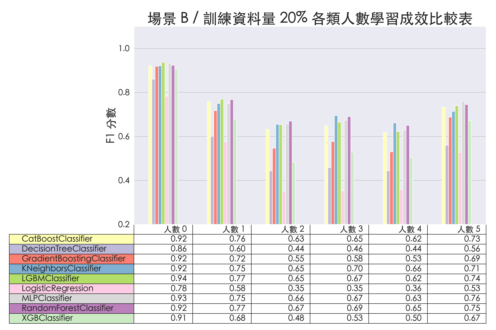

# 透過 WiFi CSI 進行人數預測

## 從不同角度觀察模型學習成效

### 隨機種子 3 在場景 B 中不同模型對不同人數類別的學習成效

#### 一、訓練資料量 5% 時的學習成效

#### 二、訓練資料量 10% 時的學習成效

#### 三、訓練資料量 15% 時的學習成效

#### 四、訓練資料量 20% 時的學習成效

#### 五、訓練資料量 25% 時的學習成效

#### 六、訓練資料量 35% 時的學習成效

#### 七、訓練資料量 45% 時的學習成效

#### 八、訓練資料量 55% 時的學習成效

#### 九、訓練資料量 65% 時的學習成效

#### 十、訓練資料量 75% 時的學習成效

