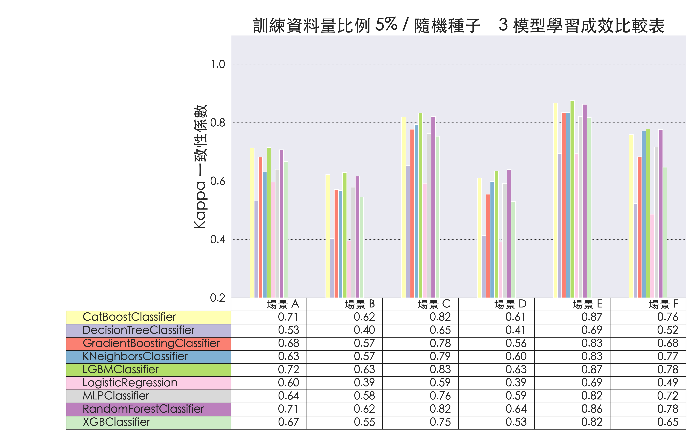
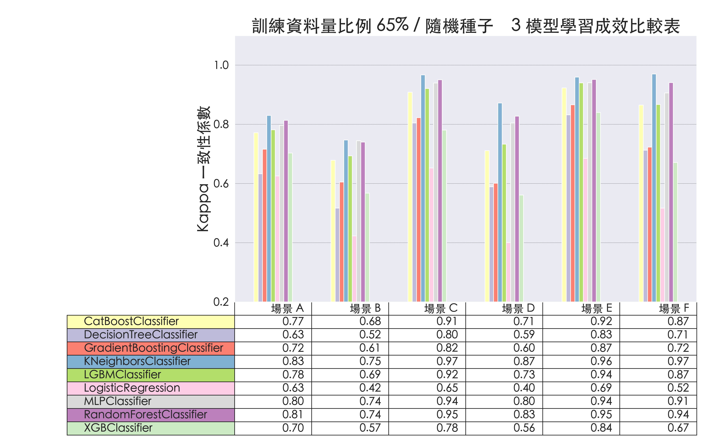

# 透過 WiFi CSI 進行人數預測

## 從不同角度觀察模型學習成效

### 隨機種子 3 在不同模型下的學習成效

#### 各模型在 5% 訓練資料比例時的學習成效

#### 各模型在 10% 訓練資料比例時的學習成效

#### 各模型在 15% 訓練資料比例時的學習成效

#### 各模型在 20% 訓練資料比例時的學習成效

#### 各模型在 25% 訓練資料比例時的學習成效

#### 各模型在 35% 訓練資料比例時的學習成效

#### 各模型在 45% 訓練資料比例時的學習成效

#### 各模型在 55% 訓練資料比例時的學習成效

#### 各模型在 65% 訓練資料比例時的學習成效

#### 各模型在 75% 訓練資料比例時的學習成效
