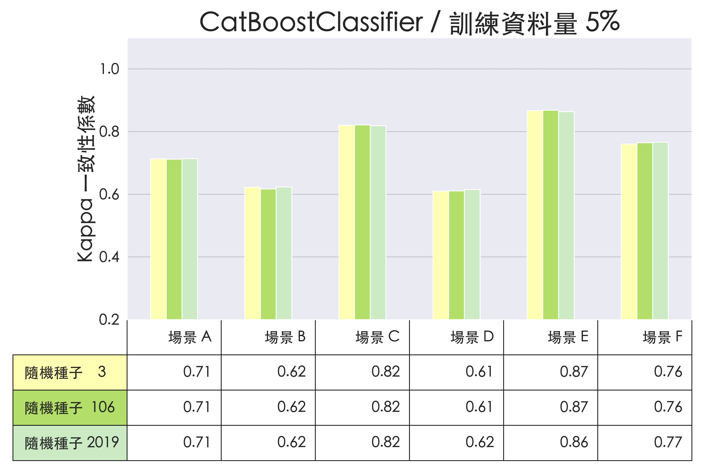
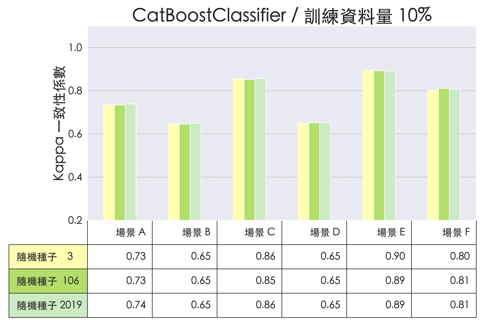
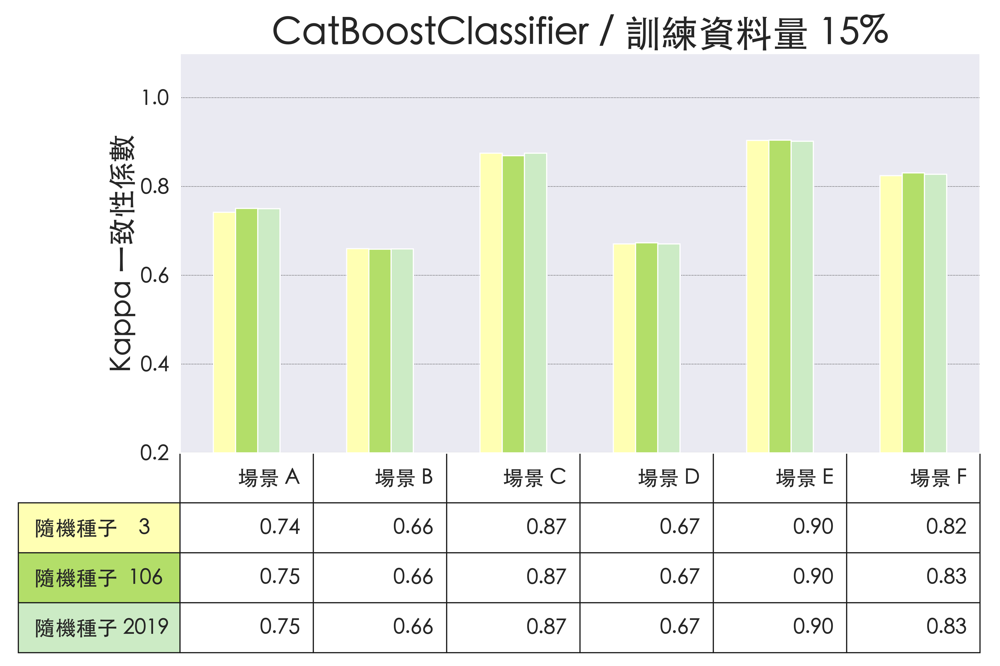
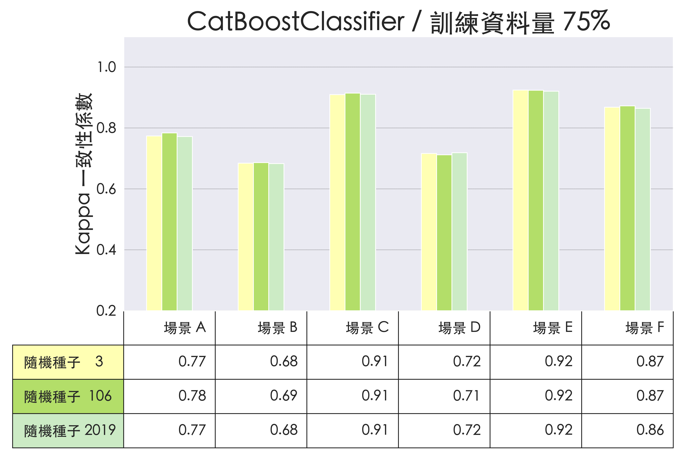

# 透過 WiFi CSI 進行人數預測

## 從不同角度觀察模型學習成效

### CatBoostClassifier 多組抽樣種子在不同場景間的學習成效

#### 一、訓練資料量 5%

#### 二、訓練資料量 10%

#### 三、訓練資料量 15%

#### 四、訓練資料量 20%

#### 五、訓練資料量 25%

#### 六、訓練資料量 35%

#### 七、訓練資料量 45%

#### 八、訓練資料量 55%

#### 九、訓練資料量 65%

#### 十、訓練資料量 75%
