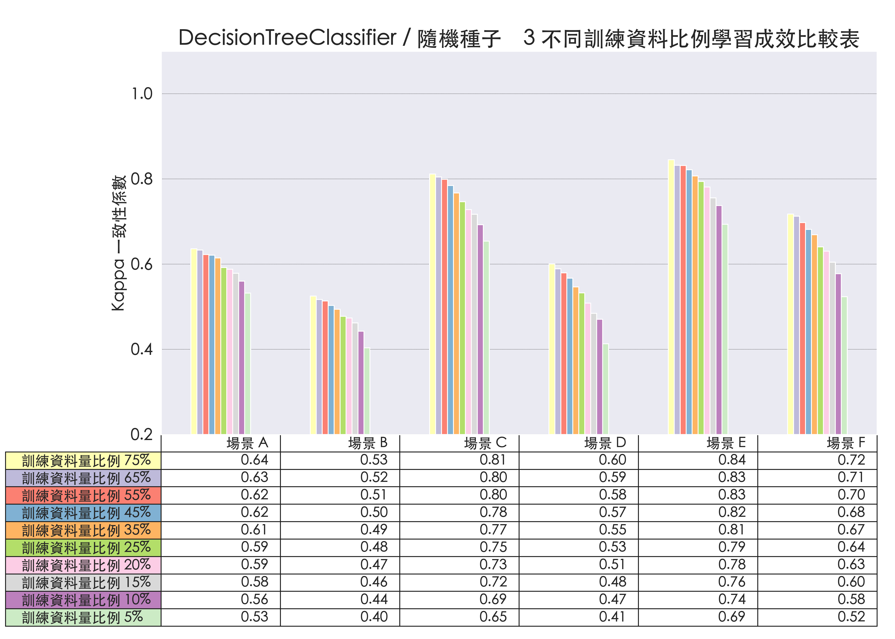
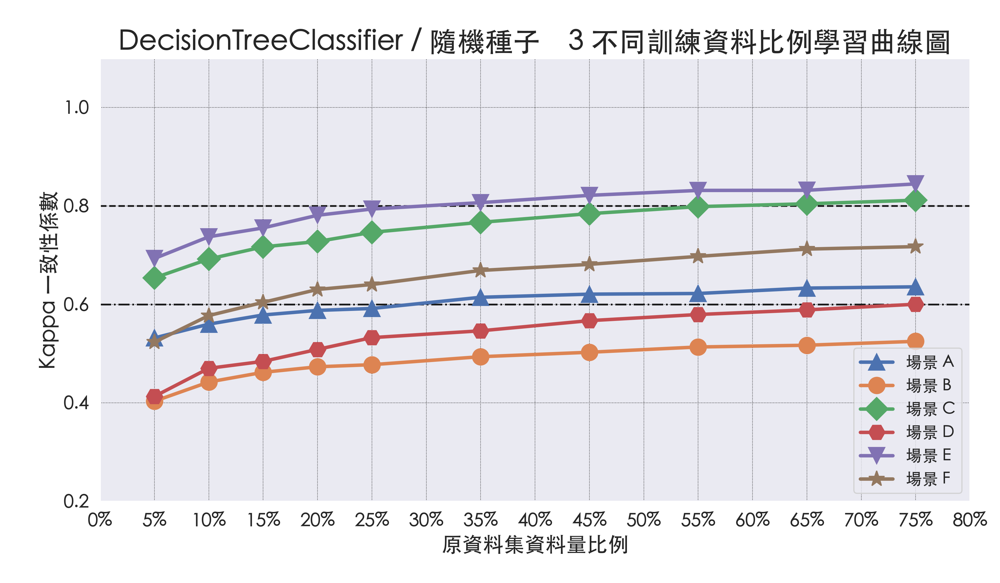
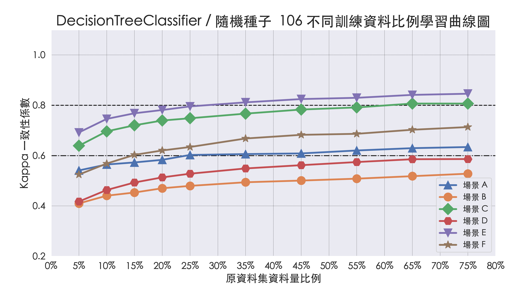
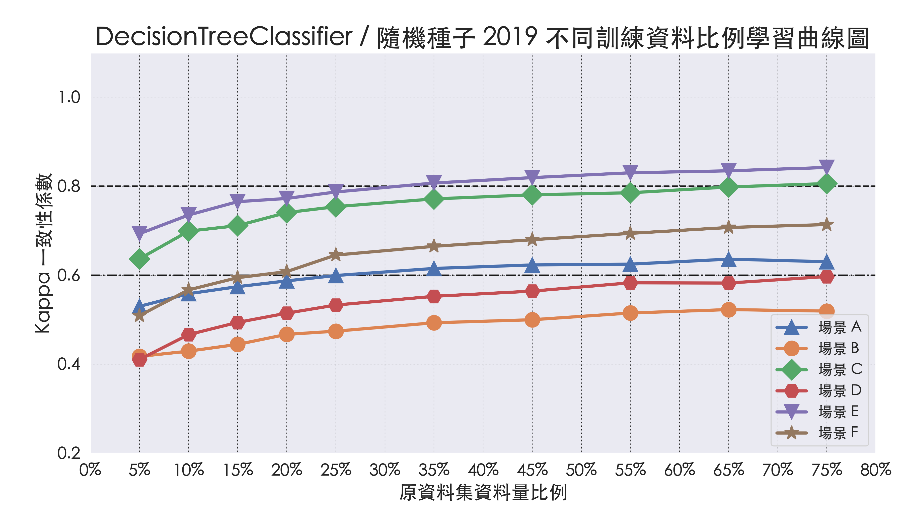

# 透過 WiFi CSI 進行人數預測

## 從不同角度觀察模型學習成效

### DecisionTreeClassifier 不同訓練資料比例在各場景的學習成效

#### 一、隨機種子 3 不同訓練資料比例在各場景的學習成效比較表

#### 二、隨機種子 3 不同訓練資料比例在各場景的學習成效曲線圖

#### 三、隨機種子 106 不同訓練資料比例在各場景的學習成效比較表

#### 四、隨機種子 106 不同訓練資料比例在各場景的學習成效曲線圖

#### 五、隨機種子 2019 不同訓練資料比例在各場景的學習成效比較表

#### 六、隨機種子 106 不同訓練資料比例在各場景的學習成效曲線圖
